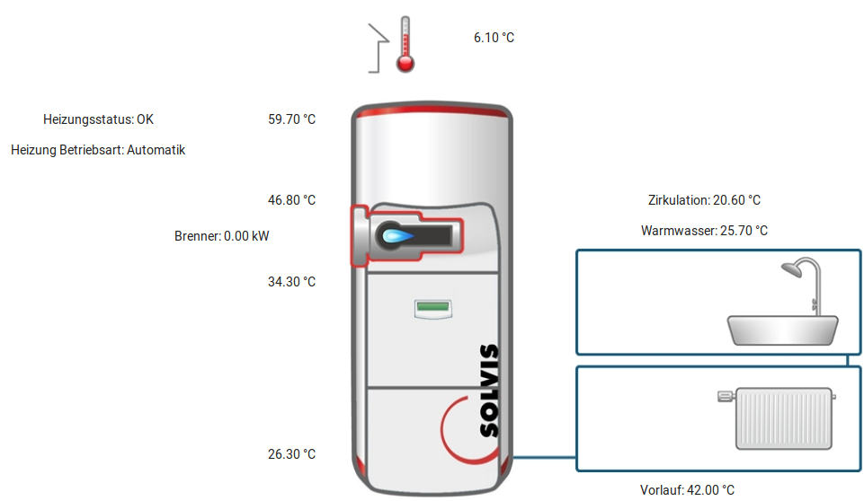
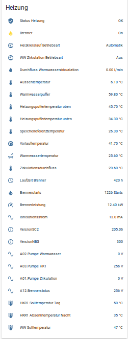
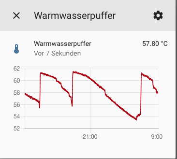
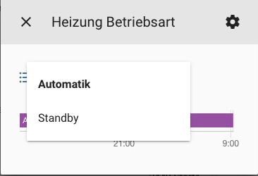
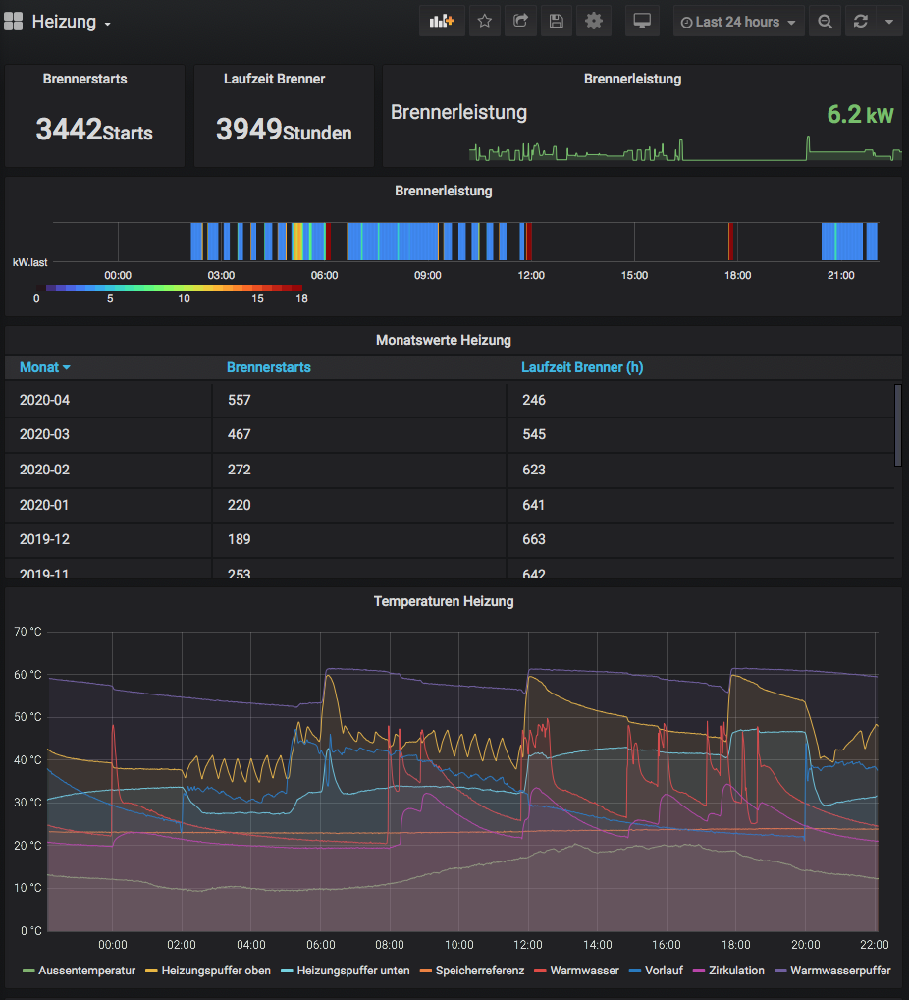
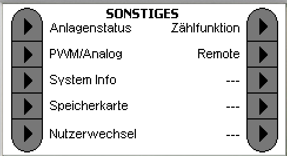
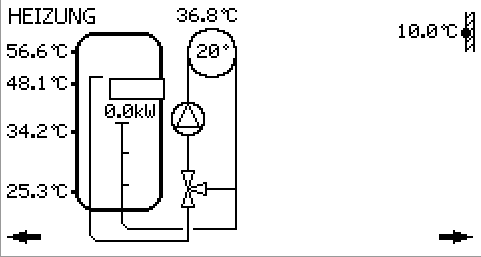

# Solvis Heizung via Modbus auslesen und steuern
Eine [Solvis Heizungsanlage](https://www.solvis.de), hier SolvisMax, lässt sich mit Hilfe der optional erhältlichen [Solvis Remote](https://www.solvis.de/solvisremote-ben-max/) fernsteuern. Die Solvis Remote bildet im Prinzip das Touchdisplay der Heizung 1:1 via Browser nach. Zusätzlich gibt es Graphen über den Temperaturverlauf der einzelnen Sensoren des Schichtenspeichers und die Möglichkeit, sich ein Anlagenschema darzustellen. 

Für eine Integration ein ein bestehendes Smart Home System, hier [Home Assistant](https://www.home-assistant.io), bietet die Solvis Remote zusätzlich die Möglichkeit die Heizung mittels Modbus-TCP Protokoll lokal auslesen und, falls gewünscht, auch steuern zu können. 

Vorbildlich ist die Bereitstellung aller Dokumentationen inkl. Modbus Register von Solvis auf deren Webseite. 

## benötigte Hardware
* Solvis Heizung, hier SolvisMax 7
* Solvis Control 2 (SC2)
* Solvis Remote zur Anbindung ans Netzwerk und Bereitstellung des Modbus-TCP Protokolls


## Home Assistant Übersicht
In Home Assistant wurde die Ansicht der Anlage auf der Solvis Remote nachgebildet


Zusätzlich gibt es eine Detail-Ansicht der einzelnen Sensoren und Stati.


Klick auf die einzelnen Sensoren bringen die Historie des Sensors bzw. die Auswahlmöglichkeiten zur Steuerung, z.b. den HKR1-Betriebsmodus zu ändern

 


## Langzeitauswertung mit Grafana/InfluxDB
Für Langzeitstatistiken werden die Daten von Home Assistant in einer InfluxDB Datenbank gespeichert und mittels Grafana visualisiert.


Für die monatliche Auswertung der Brennerstarts und Laufzeit des Brenners werden mit folgenden Queries die Daten ermittelt:
```
SELECT spread("value") FROM "Starts" WHERE ("entity_id" = 'brennerstarts') AND time > now()  - 365d GROUP BY time(30d) fill(null)

SELECT spread("value") FROM "h" WHERE ("entity_id" = 'laufzeit_brenner') AND time > now() - 365d  GROUP BY time(30d) fill(null)
```

## Aktivierung Modbus Protokoll
Zur Aktivierung von Modbus TCP muss in das Installateurmenü gewechselt werden. Den zugehörigen Code werde ich nicht veröffentlichen. Bitte mit dem Installateur der Heizung Kontakt aufnehmen. 
Im Menüpunkt `Sonstiges --> Remote` auswählen und dort dann den Modus für `Modbus TCP` auf `lesen` oder auch `senden` (schreiben) einstellen.
Sollten die Einstellungen korrekt sein sollte unter der IP-Addresse der Solvis-Remote auf Port TCP/502 ein Connect möglich sein.




## Auszug configuration.yaml
Nachfolgend ein Auszug der configuration.yaml von Home Assistant mit den wichtigsten Sensoren und Templates
```
modbus:
  name: SolvisRemote
  type: tcp
  host: <ip-addresse-solvis-remote>
  port: 502

 - platform: modbus
    scan_interval: 30
    registers:
    - name: Warmwasserpuffer
      hub: SolvisRemote
      unit_of_measurement: °C
      scale: 0.1
      slave: 1
      precision: 2
      register_type: input
      register: 33024

    - name: Warmwassertemperatur
      hub: SolvisRemote
      unit_of_measurement: °C
      scale: 0.1
      slave: 1
      precision: 2
      register_type: input
      register: 33025

    - name: Speicherreferenztemperatur
      hub: SolvisRemote
      unit_of_measurement: °C
      scale: 0.1
      slave: 1
      precision: 2
      register_type: input
      register: 33026

    - name: Heizungspuffertemperatur oben
      hub: SolvisRemote
      unit_of_measurement: °C
      scale: 0.1
      slave: 1
      precision: 2
      register_type: input
      register: 33027

    - name: Aussentemperatur
      hub: SolvisRemote
      unit_of_measurement: °C
      scale: 0.1
      slave: 1
      precision: 2
      register_type: input
      register: 33033

    - name: Heizungspuffertemperatur unten
      hub: SolvisRemote
      unit_of_measurement: °C
      scale: 0.1
      slave: 1
      precision: 2
      register_type: input
      register: 33032

    - name: Zirkulationsdurchfluss
      hub: SolvisRemote
      unit_of_measurement: °C
      scale: 0.1
      slave: 1
      precision: 2
      register_type: input
      register: 33034

    - name: Vorlauftemperatur
      hub: SolvisRemote
      unit_of_measurement: °C
      scale: 0.1
      slave: 1
      precision: 2
      register_type: input
      register: 33035

#    kein Sensor angeschlossen, zeigt immer 10°C  
#    - name: Kaltwassertemperatur
#      hub: SolvisRemote
#      unit_of_measurement: °C
#      scale: 0.1
#      slave: 1
#      precision: 2
#      register_type: input
#      register: 33038
      
    - name: Durchfluss Warmwasserzirkualation
      hub: SolvisRemote
      unit_of_measurement: l/min
      slave: 1
      precision: 2
      scale: 0.1
      register_type: input
      register: 33041

    - name: Laufzeit Brenner
      hub: SolvisRemote
      unit_of_measurement: h
      slave: 1
      precision: 0
      register_type: input
      register: 33536

    - name: Brennerstarts
      hub: SolvisRemote
      unit_of_measurement: Starts 
      slave: 1
      precision: 0
      register_type: input
      register: 33537

    - name: Brennerleistung
      hub: SolvisRemote
      unit_of_measurement: kW
      scale: 0.1
      slave: 1
      precision: 2
      register_type: input
      register: 33539

    - name: Ionisationsstrom
      hub: SolvisRemote
      unit_of_measurement: mA 
      slave: 1
      scale: 0.1
      precision: 1
      register_type: input
      register: 33540

    - name: VersionSC2
      hub: SolvisRemote 
      slave: 1
      scale: 0.01
      precision: 2
      register_type: input
      register: 32770

    - name: VersionNBG
      hub: SolvisRemote 
      slave: 1
      scale: 0.01
      register_type: input
      register: 32771

    - name: ZirkulationBetriebsart
      hub: SolvisRemote 
      slave: 1
      register_type: input
      register: 2049

    - name: A01.Pumpe Zirkulation
      hub: SolvisRemote 
      slave: 1
      unit_of_measurement: V
      scale: 0.01
      precision: 0
      register_type: input
      register: 33280
 
    - name: A02.Pumpe Warmwasser
      hub: SolvisRemote 
      slave: 1
      unit_of_measurement: V
      scale: 0.01
      precision: 0
      register_type: input
      register: 33281

    - name: A03.Pumpe HK1
      hub: SolvisRemote 
      slave: 1
      unit_of_measurement: V
      scale: 0.01
      precision: 0
      register_type: input
      register: 33282

    - name: A12.Brennerstatus
      hub: SolvisRemote 
      slave: 1
      unit_of_measurement: V
      scale: 0.01
      precision: 0
      register_type: input
      register: 33291

    - name: DigIn Stoerungen
      hub: SolvisRemote 
      slave: 1
      register_type: input
      register: 33045
     
    - name: HKR1 Betriebsart
      hub: SolvisRemote 
      slave: 1
      register_type: holding
      register: 2818
      
    - name: WW Solltemperatur
      hub: SolvisRemote 
      unit_of_measurement: °C
      slave: 1
      register_type: holding
      register: 2305
     
    - name: HKR1 Solltemperatur Tag
      hub: SolvisRemote 
      unit_of_measurement: °C
      slave: 1
      register_type: holding
      register: 2820
      
    - name: HKR1 Absenktemperatur Nacht
      hub: SolvisRemote 
      unit_of_measurement: °C
      slave: 1
      register_type: holding
      register: 2821
      
      
      
  - platform: template
    sensors:
      ww_zirkulationsart:
       friendly_name: "WW Zirkulation Betriebsart"
       entity_id: sensor.zirkulationbetriebsart
       value_template: >-
          
            Aus
          
            Puls
          
            Temp
          
            Warten
          
            unbekannt
          
            
        
      hkr1betriebsart:
        friendly_name: "Heizkreislauf Betriebsart"
        entity_id: sensor.hkr1_betriebsart
        value_template: "AusAutomatikTagbetriebAbsenkbetriebStandbyEcoUrlaubWW VorangFrostschutzPumpenschutzEstrich"
         
   
```

## Raumtemperatur per Modbus-Register statt Raumbedienelement 
Normalerweise wird über das (optionale) Raumbedienelement die Raumtemperatur an die Solvis Control2 (SC2) gemeldet. Dadurch kann die Heizung die Regelung an die erreichte Raumtemperatur anpassen.

Da im Haus keine einfache Verkabelung des Raumbedienelements möglich war, es aber ein Modbus Register 34304 (Raumtemperatur 1) gibt, war die Idee geboren die Raumtemperatur über die in Home Assistant vorhandenen Zigbee Temperatursensoren per Modbus in das Register zu schreiben, was zunächst fehlschlug, trotz aktiviertem schreibenden Modbus-Zugriff. Allerdings war zu dem Zeitpunkt die SC2 noch nicht für ein Raumbedienelement eingerichtet.

Nach Kontaktaufnahme mit Solvis bekam ich die Infos dir mir fehlten. Vielen Dank hierfür an [Wolf Walter](https://github.com/saruter/smarthome/issues/1)

### Voraussetzungen
- Solvis Control muss mit Raumbedienelement für den Heizkreislauf konfiguriert sein (auch wenn kein Raumbedienelement per Kabel angeschlossen wird)
- dafür ist ein Zurücksetzen der Solvis Control auf Werkseinstellung nötig, da in der Initialisierung das Raumbedienelement zum Heizkreislauf zugeordnet wird
- Anschließend muss im Installateur-Menü unter `Sonstiges --> Remote --> Seite 3 --> Raumfühler HK1` auf `Modbus` umgestellt werden

- und der Modbus-Modus muss auf `senden` was dem schreibenden Zugriff entspricht umgestellt werden, falls noch nicht geschehen

Hinweis
- Die Temperatur muss ca. alle 60 Sekunden per Modbus in das Register geschrieben werden, sonst "verschwindet" die Temperatur in der Anzeige und zeigt nur noch "--"


### zyklisches setzen der Raumtemperatur in Home Assistant
Eine Automatisierung schreibt den Sensorwert eines Zigbee Temperatursensors alle 30 Sekunden in das Modbus Register.

Dazu muss der Wert des Sensors konvertiert werden, da das Modbus-Register den Wert in 0.1°C skaliert erwartet. Zudem muss der Wert in ein `int` gewandelt werden da der `modbus.write_register`-Service ein `int` erwartet.

#### Automatisierung
```
  - alias: Heizung Raumtemperatur per Modbus aktualisieren
    trigger:
      platform: time_pattern
      seconds: "/30"
    action:
    - service: modbus.write_register
      data_template:
        address: 34304
        hub: SolvisRemote
        unit: 1
        value: "{{ (states('sensor.temperatur_wohnzimmer') | float * 10) | int }}"
```

### Raumtemperaturanzeige in der SC2
Bei erfolgreichem setzen der Temperatur erscheint diese in der Solvis Control




## Stundenweises umschalten von Automatik auf Standby-Betrieb


Gerade in der Übergangszeit kann es vorkommen, dass an sonnigen Tagen trotz noch kühler Außentemperatur es in den Zimmern durch die Sonneneinstrahlung bereits warm ist. Die Heizung aber noch wegen der kühlen Außentemperatur weiterhin läuft bis auch die Außentemperatur entsprechend später am Tag steigt.

Hier wäre ein Nutzungsszenario für folgende Automatisierung:
Schalte den Heizkreis auf Standby-Modus für x-Stunden (z.B. bis Abends).


Realisiert ist dies über einen `timer` in Home-Assistant, dessen Zeitwert (Stunden) per `input_number` gesetzt wird (Schieberegler im Frontend). Über ein `input_boolean` (Ein-/Ausschalter im Frontend) wird dann eine Automatisierung ausgeführt, die den Timer startet (`service: timer.start`) und das Modbus Register 2818 auf den Wert `5` (HKR1 Standbymodus) schreibt.

Wenn der Timer abgelaufen ist, startet eine zweite Automatisierung (getriggert durch `event_type: timer.finished`) die dann den Ein-/Ausschalter wieder auf "Aus" setzt.

Durch das setzen des Ein-Ausschalters auf "Aus" durch diese Automatisierung wird wiederum eine weitere Automatisierung getriggert die dann zum Einen das Modbus-Register 2818 wieder auf `2` (Automatik) setzt, also den Heizkreis wieder in den normalen Automatikmodus versetzt. Der zweite Anwendungsfall ist das manuelle Umschalten des Ein-/Ausschalters in der Weboberfläche auf "Aus" um wieder manuell auf "Automatik" umzuschalten. Auch hier triggert diese Automatisierung. 
### Konfiguration Home-Assistant
```
# Eingabefelder 
input_number:
  delayheizungstandby:
    name: Stunden auf Standby
    initial: 5
    min: 0
    max: 8
    step: 1
    icon: mdi:timer
    
input_boolean:
  heizungstandbyon:
    name: Heizung stundenweise auf Standby
    initial: off


# Timer for setting heating on standby for x hours
timer:
  heizungaufstandbyfor:
    name: Noch auf Standby für


automation:

  - alias: Heizung auf Standby Start
    trigger:
      platform: state
      entity_id: input_boolean.heizungstandbyon
      to: 'on'
    action:
    -  service: timer.start
       entity_id: timer.heizungaufstandbyfor
       data_template:
         duration: "{{ states('input_number.delayheizungstandby') | int * 60 * 60 }}"
    - service: modbus.write_register
      data:
        address: 2818
        hub: SolvisRemote
        unit: 1
        value: 5    
        
        
  - alias: Heizung Standby To Automatic
    trigger:
      platform: state
      entity_id: input_boolean.heizungstandbyon
      to: 'off'
    action:
    - service: timer.cancel
      entity_id: timer.heizungaufstandbyfor
    - service: modbus.write_register
      data:
        address: 2818
        hub: SolvisRemote
        unit: 1
        value: 2


  - alias: Heizung Standby Timer Finished
    trigger:
      platform: event
      event_type: timer.finished
      event_data:
        entity_id: timer.heizungaufstandbyfor
    action:
    - service: input_boolean.turn_off
      data:
        entity_id: input_boolean.heizungstandbyon
```


## Links zu Solvis Doku
[Doku: Solvis Modbus Register](https://solvis-files.s3.eu-central-1.amazonaws.com/seiten/produkte/solvisremote/Download/SolvisRemote+Modbus+Spezifikationen+201906.pdf)

