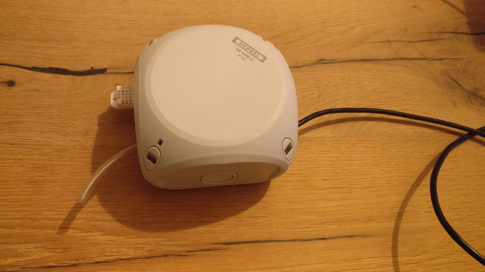

# Feinstaubsensor mit ESP8266 und Home Assistant
Nachfolgend ein paar Infos wie man einen ESP8266-basierenden Feinstaubsensor nach Anleitung von [Luftdaten.info](https://www.luftdaten.info) in Home Assistant einbindet. Zusätzlich wird ein mögliches Gehäuse gezeigt da das Verstauen der Elektronik gezeigt.





## benötigte Hardware
* ESP8266
* etwas Kabel
* etwas Schlauch (z.B. Aquarienschlauch für CO2)
* Feinstaubsensormodul SDS011
* (optionale weitere Sensoren), hier DHT22 für Temperatur und Luftfeuchte
* Gehäuse, hier eine [Abzweigdose](https://www.hornbach.de/shop/Hensel-Feuchtraum-Abzweigkasten-104x104x70-mm-DK0400G/6272644/artikel.html)

## Einrichtung
Die Einrichtung wird hier nicht beschrieben, siehe die Anleitungen unter [Luftdaten.info](https://www.luftdaten.info)

## Home Assistant
Die Firmware von [Luftdaten.info](https://www.luftdaten.info) bietet auch eine lokale API-Schnittstelle die sich per Home-Assistant auslesen lässt.


Auszug configuration.yaml

```
  - platform: command_line
    name: "Luftdata PM10"
    command: 'curl http://ipfeinstaubsensor/data.json'
    value_template: "{{ value_json.sensordatavalues[0].value | round(2) }}"
    unit_of_measurement: "µg/m³"
  - platform: command_line
    name: "Luftdata PM2.5"
    command: 'curl http://ipfeinstaubsensor/data.json'
    value_template: "{{ value_json.sensordatavalues[1].value | round(2) }}"
    unit_of_measurement: "µg/m³"
  - platform: command_line
    name: "Luftdata Temperatur DHT22"
    command: 'curl http://ipfeinstaubsensor/data.json'
    value_template: "{{ value_json.sensordatavalues[2].value | round(1) }}"
    unit_of_measurement: "°C"
  - platform: command_line
    name: "Luftdata Luftfeuchte DHT22"
    command: 'curl http://ipfeinstaubsensor/data.json'
    value_template: "{{ value_json.sensordatavalues[3].value | round(1) }}"
    unit_of_measurement: "%"
  - platform: command_line
    name: "Luftdata_WLAN_Empfang"
    command: 'curl http://ipfeinstaubsensor/data.json'
    value_template: "{{ value_json.sensordatavalues[7].value | round(0) }}"
    unit_of_measurement: "dBm"
  
  - platform: statistics
    name: pm10 stats
    entity_id: sensor.luftdata_pm10
    max_age:
      minutes: 60
  - platform: statistics
    name: pm25 stats
    entity_id: sensor.luftdata_pm2_5
    max_age:
      minutes: 60

```