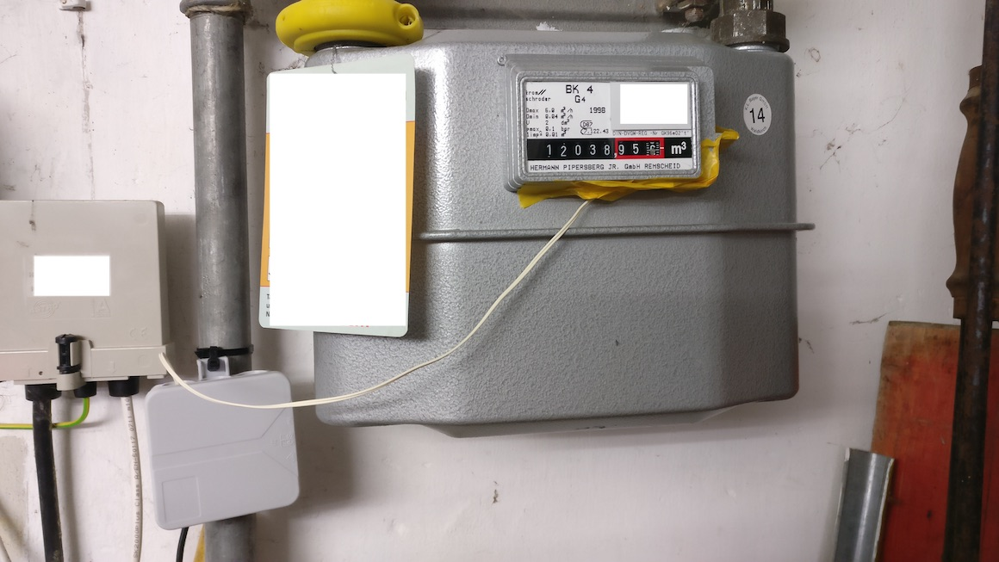

# Gaszähler mit ESP8266 und Home Assistant auslesen
Ein Standardgaszähler hat auf den letzen Ziffern einen Magneten verbaut, der bei jedem Durchlauf mit einem Reed-Kontakt ausgelesen werden kann. Ein Reed-Kontakt (Magnetschalter) erzeugt bei jedem Durchlauf einen Impuls. Diese Impulse werden per ESPhome gezählt und in die Kubikmeter umgerechnet. 1 Impuls entspricht 0,01 m³.




## benötigte Hardware
* ESP8266 NodeMCU
* Reed Sensor, z.B. MK-471B bei Reichelt
* Käbelchen
* USB-Netzteil
* Gehäuse, z.B. [Kabelabzweigdose](https://www.hornbach.de/shop/Feuchtraum-Kabelabzweigkasten-H75-x-B75-x-T35-mm-grau/3880536/artikel.html)

## Software auf ESP8266
* [ESPHome](https://esphome.io)

## Auszug ESPhome YAML
```
  - platform: pulse_counter
    pin: 
      number: GPIO5
      mode: INPUT_PULLUP
    name: "Gasverbrauch"
    update_interval : 60s
    filters:
      - lambda: |-
          static float total_value = 0.0;
          total_value += x * 0.01;
          return total_value;
    unit_of_measurement: "m³"
    accuracy_decimals: 2
    icon: 'mdi:fire'
```

# Auswertung in Grafana
Zur besseren Darstellung der Verbrauchsdaten bietet sich Grafana an. Die Daten von Home Assistant werden hier in eine InfluxDB geschrieben und über Grafana visualisiert.


