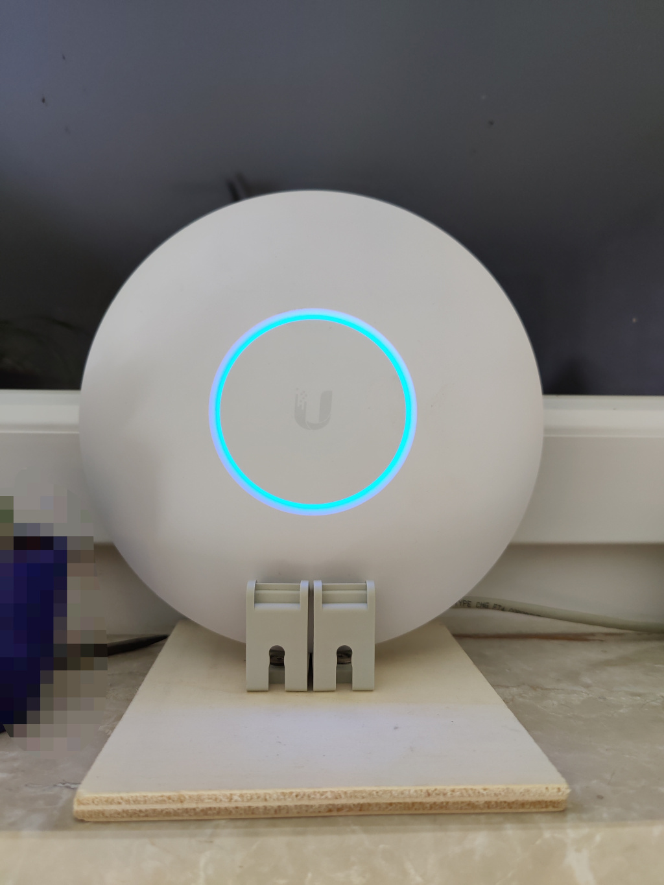

# DIY Halterung für Unifi AC-Pro Accesspoint
Unifi APs werden entweder an der Decke oder an einer Wand montiert. Falls man sich die Löcher bei einer Wandmontage sparen möchte, z.B. weil man den AP auf einem Regal o.ä. platzieren möchte, hier ein kleiner Tipp für eine DIY-Halterung.

Benötigtes Material:
- Eine Unterlage, z.B. Holzbrett
- Kabelsammelhalterung in der Höhe 4,5 cm ([z.B. die hier](https://www.hornbach.de/shop/Kabelsammelhalterung-Groesse-8-grau-4-Stueck-wiederverschliessbar/5010777/artikel.html))
- paar kurze Schrauben

Die Kabelsammelhalter rasten in der geöffneten Position genau in den runden Rasterring auf der Rückseite des APs ein. Dadurch kann er nun recht stabil in die Kabelsammelhalter gesteckt werden

# Fotos

