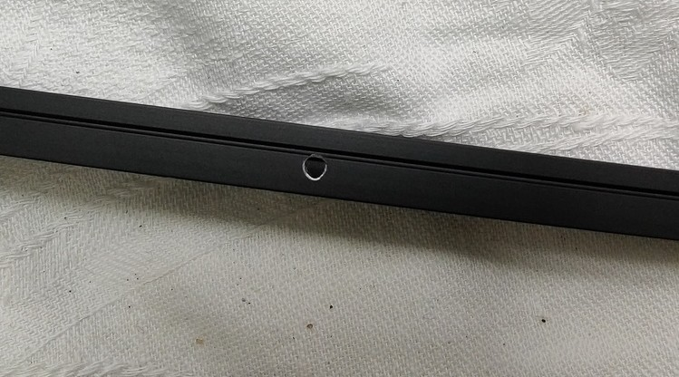
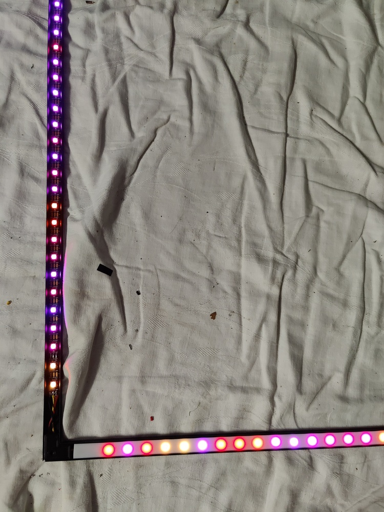
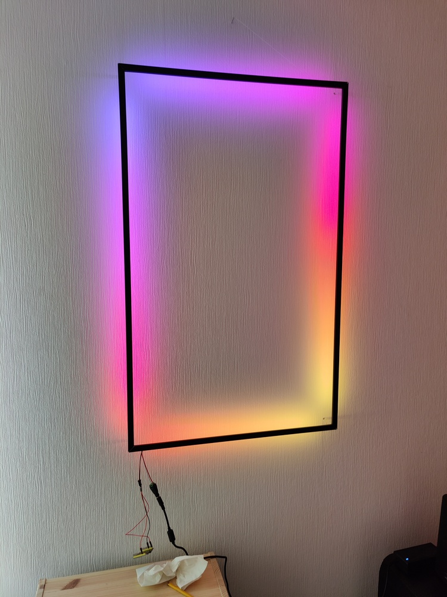
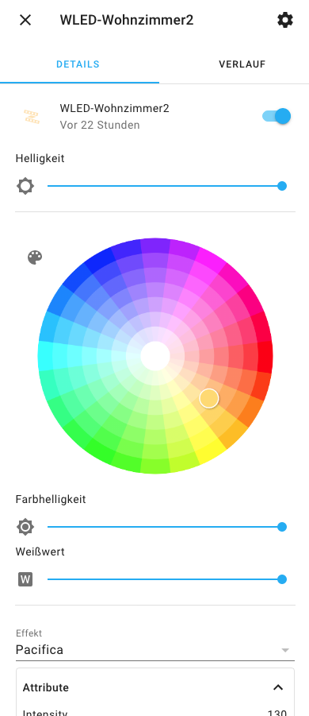

# DIY Lichtrahmen mit WLED und Home Assistant

Inspiriert wurde das von [folgender Seite](https://style.oversubstance.net/2020/08/create-a-hue-compatible-diy-led-light-sculpture/) bzw. die [Reflektion-Lichtskulpturen](https://reflektion.shop/). 
Der Lichtrahmen besteht aus schwarz eloxierten Aluprofilen inklusive Diffusor und ist mit Abstand zur Wand montiert, so dass keine einzelnen LEDs mehr sichtbar sind. Die Aufhängung erfolgt mittels einem fast unsichtbaren Nylon-Faden wie bei einem Bilderrahmen.

{: style="width:300px"}

## Benötigtes Werkzeug
- Gehrungssäge für Metall (je präziser desto besser)
- evtl. kleine Metallsäge für Feinarbeiten (Aussparung LED-Stromzuführung)
- Lötkölben
- Feilen/Schleifpapier zum Entgraten
- 3D-Drucker
- Bohrmaschine/Akkuschrauber mit 2 mm Bohrer

## Benötigtes Material  
- Alu-Profile inkl. Diffusor-Abdeckung ([z.B.diese hier](https://meine-leds.com/Aufputz-Flach-12mm-Serie-ECO))
- L-Verbinder für die Alu-Profile: Hier habe ich [diese hier](https://www.thingiverse.com/thing:4570908) verwendet, und im Cura-Slicer auf die Maße 22x22x4mm skaliert, gedruck mit PLA
- Acryl-Rundstäbe als Abstandshalter zur Wand (hier 5 mm, geht auch dünner)
- Nylon-Schnur (Drachenschnur) für die Aufhängung wie ein Bilderrahmen
- LED-Streifen (hier ein RGBWW-Streifen mit 60 LEDs/m auf Basis mit SK6812 Modulen für die individuelle Steuerung und einem separaten Warmweis-Kanal, Betriebsspannung 5V, Länge 5m) (AliExpress oder Amazon)
- 5V/10A Netzteil (3-4 A reichen für die Anzahl LEDs auch aus)
- Kabel um die einzelnen LED-Segmente miteinander zu verbinden
- ESP32 für die Ansteuerung
- [WLED](https://github.com/Aircoookie/WLED) als Software auf ESP32 für die Ansteuerung der LEDs 

## Hinweise bevor es losgeht

- Aluminium ist weich, und schwarz eloxiertes Aluminium ist noch empfindlicher da jeder Kratzer sofort die schwarze Farbe löst und unschöne Stellen zurücklässt. Also alle Arbeiten mit dem Aluminium sehr sorgfältig ausführen. Z.B. immer Stoff oder Tücher unterlegen, beim Sägen die Gehrungssäge auskleiden.
- Alle Arbeiten an den Alu-Profilen am besten an einem Probestück erstmal testweise durchführen (z.B. das Sägen oder Bohren von Löchern)

## Bau des Lichtrahmens

### Aluprofile zuschneiden
Sorgfältig und präzise sägen! Am besten die Alu-Profile mit einer Schraubzwinge oder ähnlichem fixieren. Beachtet, dass das Alu sehr empfindlich ist und Kratzer direkt sichtbar sind. Am besten immer mit Stoff Kontaktflächen schützen. Mehrmals prüfen ob man auch den Winkel in die richtige Richtung sägt..

### Aluprofile zusammensetzen
Sind die Aluprofile zugesägt und bilden eine Rahmen, muss dieser zusammengesteckt werden. Ich druckte dazu [diese hier](https://www.thingiverse.com/thing:4570908)  aus und skalierte sie für das Aluprofil mit folgenden Werten: 22x22x4 mm (LxBxH). Hier am besten ein paar Probedrucke anfertigen und schauen ob diese schön bündig passen. Unter dem Verbinder müssen noch die Kabel für die Verbindung der einzelnen LED-Streifen hindurchpassen.

### Löcher für Aufhängung bohren
In das Aluprofil für die Oberseite des Lichtrahmens werden mit einem 2 mm Bohrer zwei Löcher für die Aufhängung gebohrt. Die Löcher entgraten. Später werden hier die Schnüre für die Aufhängung durchgeführt.

### Aussparung für Zuleitung LED-Streifen
Sofern gewünscht, kann auf dem Aluprofil der Unterseite eine Kerbe ausgesägt werden um die Zuleitung des LED-Streifens dort durchzuführen. Auch hier Entgraten um scharfe Kanten zu vermeiden.

### LED-Streifen zuschneiden
Nun werden die einzelnen LED-Streifen aus dem 5m LED-Strip zugeschnitten. Der LED-Streifen hat Schnittmarkierungen mit Lötpunkten um diese später wieder zu verbinden. 

Schwierig sind die Ecken des Lichtrahmens. Gerade die Zuleitung des LED-Streifens nimmt etwas Platz am Anfang weg. Basierend auf dessen wurden die Abstände der ersten LED zu den Ecken gleich gewählt. Je weiter der Abstand zu den Ecken, desto dunkler wird später die Ecke auch ausgeleuchtet. Dies also beachten.

### LED-Streifen einkleben und verbinden
Anschließend werden die einzelnen LED-Streifen in die einzelnen Alu-Profile eingeklebt. 
!!! tip
    An den Enden der einzuklebenden LED-Streifen vorher ein Stück Isolierband auf das Aluprofil einkleben um später beim Löten evtl. Verbindungen mit dem Aluminium zu vermeiden

Die Streifen auf der kurzen und langen Seite sollten jeweils die gleiche Anzahl von LEDs haben um eine gleichmäßige Ausleuchtung zu erhalten. Anschließend die LED-Streifen der einzelnen Seiten über Eck miteinander verlöten mit kurzen Kabeln/Litzen. Die Kabel werden unter die 3D-gedruckten L-Verbinder verlegt. 

!!! tip
    Tip für nicht-Lötspezialisten: opfert beim zuschneiden der LED-Streifen lieber eine LED um dafür einen kompletten Lötpunkt an der Schnittkante zu erhalten. Schneidet man die LEDs genau in der Mitte der Lötpunkte/Schnittkante ist dies schon sehr knapp für eine weitere Anbindung. 
    
    Weiterer Tip: Kabel/Litze vorher mit Lötzinn benetzen und anschließend auch erst die Lötpunkte mit Lötzinn versehen damit es einen schönen Tropfen auf dem Lötpunkt ergibt. Dann ist das zusammenlöten der Kabel auf Lötpunkt sehr einfach und sauber.

!!! tip
    Sollten durch nicht 100%ig saubere und glatte 45°-Winkel beim Zusammenstecken der Ecken die Profile nicht ganz bündig passen und die darunter liegenden Kabel durch einen Spalt sichtbar sein, diese am besten mit schwarzem Isolierband umwickenln um dies zu kaschieren.

Anschließend ist der Lichtrahmen dann erstmal fertig zusammengebaut und kann auch nicht mehr ohne Lösen der Lötpunkte auseinandergenommen werden.

### Diffusor einsetzen
Die Diffusorprofile einfach auf die richtige Länge zuschneiden und einklipsen.

### Verkabelung 
Falls nicht sowieso schon geschehen, sollte die Verkbabelung nun für das probeweise Ausprobieren erfolgen.

Der ESP32 sowie der Leuchtrahmen werden von dem 5V Netzteil versorgt. Das ESP32-DevBoard hat einen 5V Pin der mit dem Netzteil verbunden wird. GND ebenso. Das gleiche gilt für die LEDs: 5V an rot, Masse auf Schwarz. Die Steuerleitung für die LEDs muss an GPIO2 im Default. Wenn unklar bei WLED in den Docs suchen bzw. ein Pinout des ESP-Boards suchen.

!!! attention
    Falls der ESP von einer anderen Stromquelle gespeist wird als der LED-Streifen, z.B. von einem USB-Netzteil, so muss es ein einheitliches GND geben. D.h. beide GNDs müssen verbunden sein, sonst kommt es nur zu wild blinkendem LED-Pixelsalat da es dann unterschiedliche Null-Potentiale bei ESP und LED-Streifen gibt.

### Abstand zur Wand bestimmen und Abstandshalter zuschneiden
Nun gilt es den richtigen Abstand zur Wand zu bestimmen, so dass ein schön diffuses Licht erzeugt wird. Einzelne LEDs sollten nicht mehr erkennbar sein. Hier waren 5 cm der gewählte Abstand. Dazu werden dann die Acryl-Rundstäbe in die entsprechende Länge zugesägt. An den Ecken wurden diese mit Heißkleber aufgeklebt.

### Aufhängung

In die zwei Löcher des oberen Alu-Profiles wird nun ein Nylon-Faden (1 mm) befestigt. So kann der Rahmen wie ein Bild aufgehängt werden.

Resultat:

## Konfiguration in WLED

!!! tip
    Die einzelnen Seiten des Rahmens als Segmente anlegen und den Mirror-Effect aktivieren. Das ergibt sehr schöne symmetrische Effekte.

## Einbindung in Home Assistant

In der Regel wird die WLED-Instanz, sofern in gleichen Netzwerk,  automatisch von Home Assistant erkannt und kann dort leicht integriert werden. Anschließend stehen alle Möglichkeiten offen um darüber den Lichtrahmen zu steuern, Automatisierungen zu erstellen und Einstellungen zu ändern.

## Erkenntnisse
- Sauber geschnittene 45° Winkel sind nur mit einer sehr guten Gehrungssäge möglich
- beim Sägen der Elemente am besten noch einmal mehr prüfen ob der Winkel in der richtigen Richtung gesägt wird :man_facepalming:
- Beim zuschneiden der LED-Streifen: am besten eine LED opfern um einen vollständigen Lötpunkt zu bekommen. Schneidet man in der Hälfte des Lötpunktes sind die Lötpunkte schon sehr schmal (für meine Lötkenntnisse)

## Offener Punkt
Die Zuleitung zum Lichtrahmen muss noch aufgehübscht werden. Dazu soll ein Kabel möglichst einheitlich zum Lichtrahmen geführt werden und der ESP bzw Netzteil noch in einem Gehäuse unsichtbar am Boden verstaut werden.