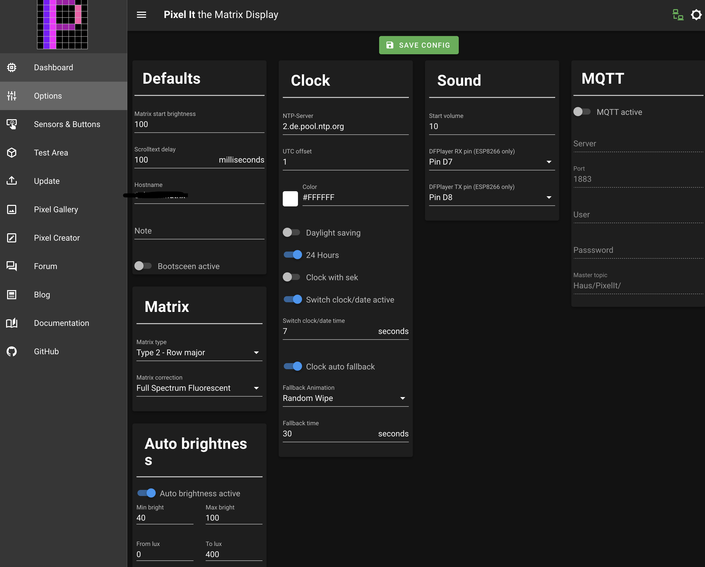

# PixelClock, smarte LED Matrix
Die PixelClock zeigt im Standard die Uhrzeit und Datum an (per NTP bezogen). Per MQTT bzw. API Schnittstellen können aber auch sogenannte Screens mit Text und Icons angezeigt werden. Ein Helligkeitssensor regelt die Helligkeit der Anzeige je nach Lichtstärke im Raum.
Basierend ist diese Anzeige auf dem Projekt [PixelIT](https://github.com/pixelit-project/PixelIt), das Gehäuse ist mit dem 3D-Drucker gedruckt.





## Benötigtes Material

- 3D-Drucker für das Gehäuse
- Wemos D1 Mini
- WS2812 8x32 Matrix
- (optional) Helligkeitssensor, z.B. LDR GL5516
- Ein 1000µF Kondensator für Stabilisierung (geht evtl. auch ohne)
- weiteres Infos zur Hardware und Software beim Projekt:
    - [bei Github](https://github.com/pixelit-project/PixelIt)
    - [Doku Seite](https://pixelit-project.github.io/)
- Gehäuse zum Drucken:
    - [Gehäuse bei Thingiverse](https://www.thingiverse.com/thing:3559014)
    - [anderes Gehäuse](https://github.com/PricelessToolkit/Pixelit_Config):
      Dieses ist das auf den Fotos sichtbare Gehäuse. Nachteil beim Gehäuse ist, dass der Stromanschluß auf der Unterseite ist. Ich habe die STL-Dateien geändert, so dass der Stromanschluß seitlich wie auf den Fotos ist.
    - Als Diffusor nutze ich einfach ein Blatt Papier
    - Für die Tönung nutze ich eine Acrylglasplatte, z.B. [hier](https://www.hornbach.de/shop/Acrylcolorplatte-3x250x500-mm-glatt-grau/8055697/artikel.html)


## Ansteuerung über Home Assistant
Das Pixel It Projekt nutzt Node-Red für die Anzeige von Wetterdaten/sonstigen Zuständen aus einer Heimautomatisierungslösung wie Home Assistant. Da dies bisher nicht im Einsatz ist, wurde die Ansteuerung über native Services/Automatisierungen in Home Assistant realisiert. 
D.h. zuerst wird ein REST-Call definiert (was soll auf der Uhr angezeigt werden) und dann per Automatisierung wird dieser Service dann getriggert (z.B. alle Minute die Temperatur anzeigen).

### Definiton der Services
Die Services definieren des REST-API-Call zur Pixel IT Clock, z.B. zeige die Außentemperatur mit Icon für Thermomether an. Diese Services können dann per Automatisierung getriggert werden.

In der Pixel IT Webobefläche kann man die API-Calls erst testen, auch die Icons können dort sehr einfach ausgewählt werden. Die Doku zur API befindet sich [hier](https://pixelit-project.github.io/api.html)
```
rest_command:
  pixel_aussentemperatur:
      url: http://<ip der uhr>/api/screen
      method: POST
      headers:
        accept: "application/json, text/html"
      payload: '{
              "switchAnimation": {
          "aktiv": true,
          "animation": "fade"
      },
      "bitmap": {
          "data": 
              [0,65535,65535,65535,0,65535,65535,0,0,65535,0,65535,0,65535,0,0,0,65535,63488,65535,0,65535,65535,0,0,65535,63488,65535,0,0,0,0,0,65535,63488,65535,0,0,0,0,65535,63488,63488,63488,65535,0,0,0,65535,63488,63488,63488,65535,0,0,0,0,65535,65535,65535,0,0,0,0],
          "position": {
              "x": 0,
              "y": 0
          },
          "size": {
              "width": 8,
              "height": 8
          }
      },
          "text": {
          "textString": "{{ states.sensor.aussentemperatur.state | round(1) }}°",
          "bigFont": false,
          "scrollText": false,
          "scrollTextDelay": 0,
          "centerText": true,
          "position": {
              "x": 7,
              "y": 1
          },
          "hexColor": "#ffffff"
      }
      }'
      content_type:  'application/json; charset=utf-8'
```

### Automatisierung
Hier wird jede Minute der zuvor erstellte Service getriggert um die Temperatur auf der Uhr anzuzeigen.
```
alias: Pixel IT Aussentemperatur anzeigen
description: ''
trigger:
  - platform: time_pattern
    minutes: /1
condition: []
action:
  - service: rest_command.pixel_aussentemperatur
mode: single
```
## Anwendungsbeispiele
- Waschmaschine fertig

- Trockner fertig
- Nachricht bei Türklingeln
