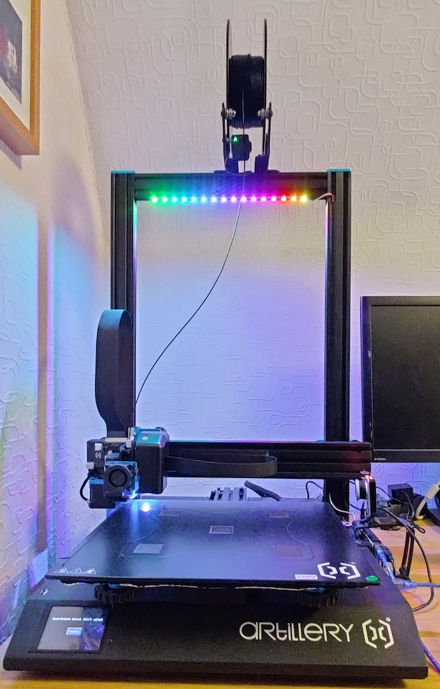
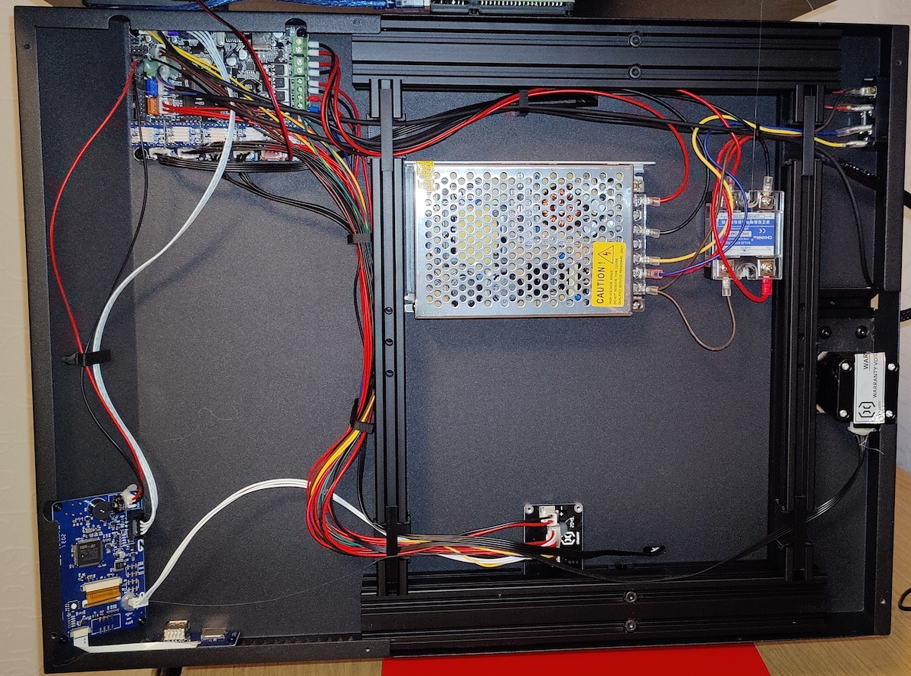
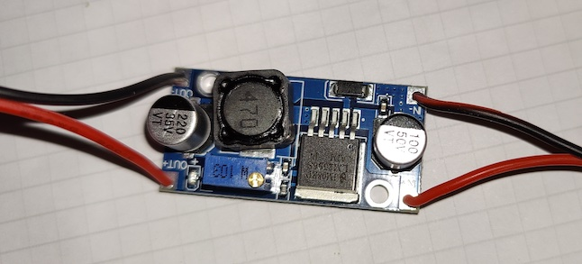
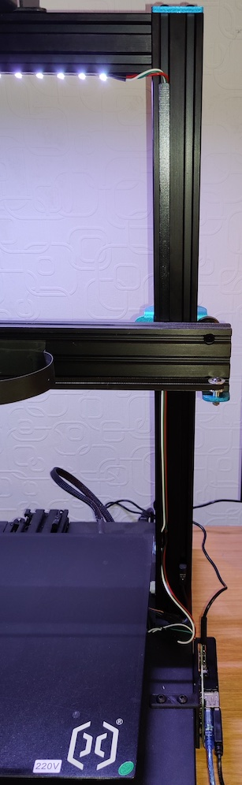

# Artillery Sidewinder X1 LED Statusbeleuchtung
Damit beim 3D-Druck auch besser zu sehen ist was gedruckt wird, macht eine Beleuchtung der Druckplatte Sinn. Ist fast schon ein klassisches Upgrade für jeden 3D-Drucker.

Hier wird ein Artillery Sidewinder X1 mit einem SK6812-LED-Streifen (insgesamt 18 LEDs) versehen. Strom bekommt der Streifen vom internen 24V-Netzteil des Sidewinders über einen Step-Down Converter der aus den 24V passende 5V macht. Dieser ist auch im Gehäuse des Sidewinders untergebracht, sodass hier nicht viel von außen zu sehen ist.
Die Kabelführung zum LED-Streifen geschieht über die rechte Z-Achse. Dort hinein wird das Kabel gelegt und mit einer gedruckten Abdeckung verblendet. Die Ansteuerung des LED-Streifens zur Anzeige von Druckstatus/Fortschritt erfolgt über einen Raspberry Pi 4 mit Octoprint und dem Plugin "WS281x LED Status".

!!! danger "Achtung!" 
    Im Gehäuse sind 230V Netzspannung anliegend. Wer hier keine Ahnung hat, besser die Finger davon lassen. Auf jeden Fall den Drucker vom Stromnetz trennen!

## benötigtes Werkzeug
* Schraubenzieher
* Lötkolben
* Schrumpfschlauch
* Aderendhülsen und Wago-Klemmen sind hilfreich bzw. empfohlen
* Multimeter

## benötigte Hardware/Teile zum Drucken
* WS2812/SK6812 LED-Streifen
* Step-Down Buck Converter, z.B. LM2596
* Kabel für Anschluß LED-Streifen + Step Down Converter
* Abdeckschienen für das Kabel zum LED-Streifen zu verstecken gibt es bei [Thingiverse](https://www.thingiverse.com/thing:4478369) zum drucken
* Gehäuse für den Step-Down Converter bei Thingiverse [Thingiverse](https://www.thingiverse.com/thing:1968276)
* für eine Steckverbindung zw. LED-Streifen und den im Sidewinder befindlichen Teilen benutze ich noch 3-Polige Schnellverbinder für LED-Streifen

## Plugin für Octoprint
* [OctoPrint WS281x LED Status](https://github.com/cp2004/OctoPrint-WS281x_LED_Status)

# Aufbau
## Sidewinder öffnen um an die Innereien zu kommen
* Stecker aus dem Netzteil!
* Die kleinen Schrauben an der Bodenplatte lösen, Achtung die Garantie erlischt ab dem Moment!
* Beim Abnehmen der Bodenplatte muss noch der Lüfter vom Mainboard abgezogen werden

## Buck-Converter an Netzteil des Sidewinders anschließen
* Achtung: 230V am Netzteil! Stecker raus!
* Am Netzteil sind noch jeweils 1 Klemme für V+ und V- (24V) frei. Hier kann der Spannungswandler angeschlossen werden. Vorher muss dieser natürlich entsprechend mit Kabeln angelötet werden
* Der Converter ist hier im Foto in einem kleinen Gehäuse drin

## Einstellen der Ausgangsspannung 
* Der Buck-Converter hat eine kleine Schraube an der die Ausgangsspannung eingestellt werden kann. Diese mit einem Multimeter auf ca. 5V für den LED-Streifen einstellen
* Achtung: Hierzu müsst ihr das Netzteil unter Strom setzen. Achtung: keine Teile anfassen!

## Verkabelung
Der LED-Streifen wird mit einem 3-poligen Stecker auf eine 3-Polige Buchse an der rechten Z-Achse angeschlossen. Vom Raspberry Pi führen noch 2 Jumper Kabel von den GPIOs ins Innere um ein gemeinsames GND für den LED-Streifen zu haben und für die Steuerleitung der LEDs. 
Im Sidewinder sind die einzelnen Kabel für V+, V- und D (Steuerung) dann per Wago Klemmen zusammengeschaltet.

## Einstellen des Octoprint Plugins
Dazu gibt es die Doku beim Plugin. Hier wird auch noch die Verkabelung genauer erläutert:
[Plugin Doku](https://cp2004.gitbook.io/ws281x-led-status/)
