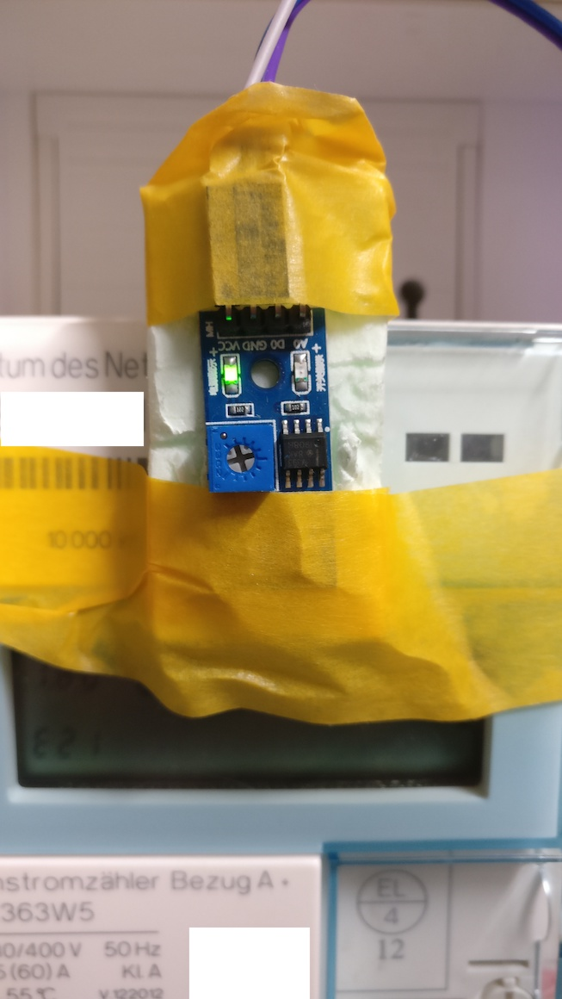
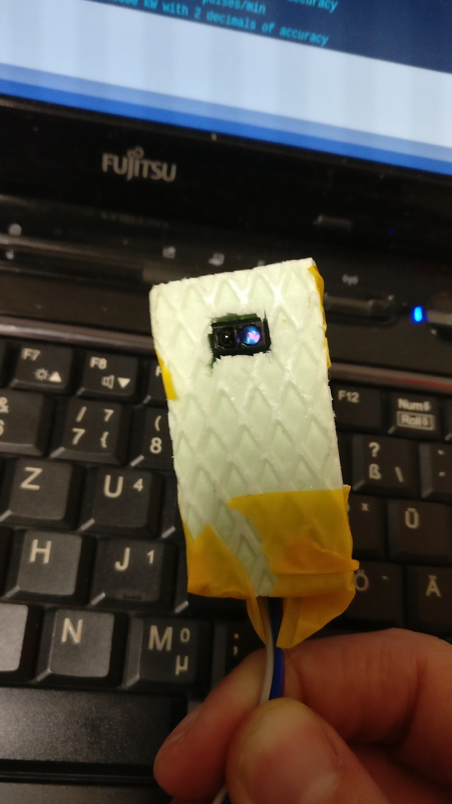

# (digitalen) Stromzähler mit ESP8266 auslesen
Das Auslesen eines digitalen Stromzählers (EhZ) geschieht anhand der optischen S0-Schnittstelle bei der der Stromzähler den Verbrauch über die Impulsrate einer IR-LED anzeigt. Hier zeigen 10000 Impulse 1 kwH an. Über die Pulsrate kann der aktuelle Leistungsbedarf in Watt berechnet werden. Die S0-Schnittstelle ist hier mittels einer IR-Led ausgeführt die mittels eines Phototransistors oder wie in meinem Fall über ein TCRT-5000 (IR-Licht/Abstandssensor) ausgelesen werden kann.

Gut zu wissen: mit einer Handykamera (meist die Selfie-Kamera) kann man meist die IR-Signale "sehen" da dort kein IR-Filter eingebaut ist. Beim Hager EhZ sieht man allerdings nur die Signale der seriellen SML-Schnittstelle. Die Impulse der S0-IR-Led waren zu schwach um sie sichtbar in der Fotoansicht zu sehen.





## Hardware
* ESP8266 NodeMCU
* Phototransistor oder TCRT-5000 (IR-Licht/Abstandssensor)
* Käbelchen
* USB-Netzteil

## Software auf ESP8266
* [ESPHome](https://esphome.io)


## Auszug ESPhome YAML
```
 - platform: pulse_counter
    pin: GPIO5
    unit_of_measurement: 'W'
    name: 'Energieverbrauch'
    update_interval: 60s
    filters:
    # - multiply: 0.06 in KW
      - multiply: 6 # in W
    accuracy_decimals: 0
    icon: 'mdi:flash'
    id: energieverbrauch_w

  # Dieser Sensor errechnet die Wh aus den aktuellen Verbrauchswerten in W  
  - platform: total_daily_energy
    name: "Tagesverbrauch"
    power_id: energieverbrauch_w
    
time:
  - platform: sntp
    id: my_time
```

## Home Assistant


Dort wird über die Integration "utility_meter" des Sensors "sensor.tagesverbrauch" (siehe ESPHome Sensor vom Typ "total_daily_energy") der Stromverbrauch in Wh über die Zeiträume 

* täglich
* wöchentlich
* monatlich
* jährlich

aufgenommen und angezeigt. Diese Sensoren dienen auch als Datenbasis zur Darstellung des Verbrauchs in Grafana via InfluxDB.

## Auszug Home Assistant Konfiguration
```
sensor:

utility_meter:
  stromverbrauch_tag:
    source: sensor.tagesverbrauch
    cycle: daily
  stromverbrauch_woche:  
    source: sensor.tagesverbrauch
    cycle: weekly
  stromverbrauch_monat:
    source: sensor.tagesverbrauch
    cycle: monthly
  stromverbrauch_jahr:
    source: sensor.tagesverbrauch
    cycle: yearly
```

## Verbrauchswerte in Grafana


