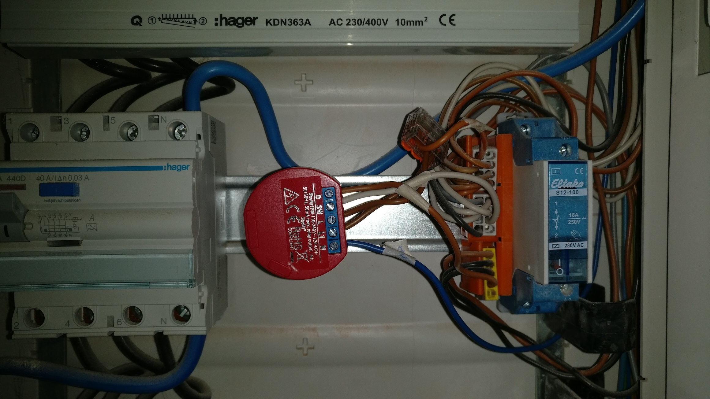
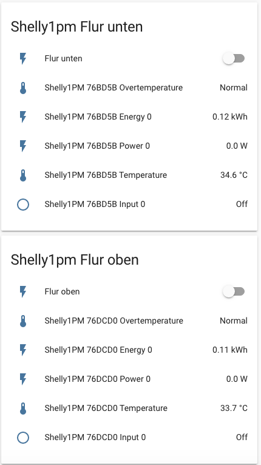
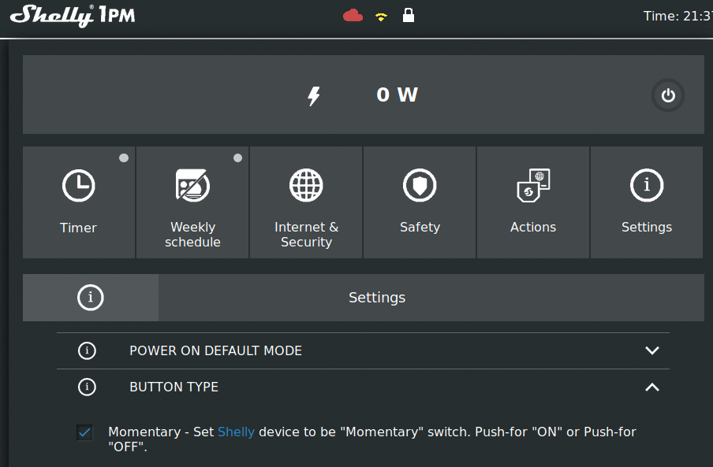

# Eltako Stromstoßrelais durch Shelly 1PM ersetzen

!!! danger "Achtung!" 
    Arbeiten an 230V können tödlich sein. Falls kein Know-How vorhanden ist, lieber einen Elektroinstallateur beauftragen! 

Durch ein Shelly 1PM wird eine Tasterschaltung für Flurlicht smart über Home Assistant steuerbar. Zusätzlich kann der Stromverbrauch gemessen werden.
Eingesetzt wurden Shelly 1PM mit der Original Firmware ohne Aktivierung der Cloud-Anbindung. Anbindung an Home Assistant via der nativen Shelly Integration für Home Assistant.
Vorteil der Shelly1PM: man kann weiterhin über die vorhandenen 230V Tasterschalter das Licht an und aus schalten.

## benötigte Hardware
* [Shelly 1PM](https://shelly.cloud)
* [Wago Klemmen](https://www.hornbach.de/shop/Wago-221-413-Compact-Verbindungsklemme-4-mm-3-Leiter-alle-Leiterarten-50-Stueck/5723506/artikel.html)
* etwas Kabel
* Know How

## Konfiguration Shelly 1PM
Damit der Shelly 1 PM als Stromstoßrelais fungiert, muss der Button-Type auf "Momentary" eingestellt werden.

## Home Assistant
Home Assistant erkennt Shelly Devices automatisch, sofern diese gemäß Anleitung eingerichtet sind. Alternativ wäre auch eine Integration über MQTT möglich, was ich vor der Einführung der nativen Integration benutzte.

