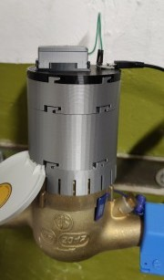
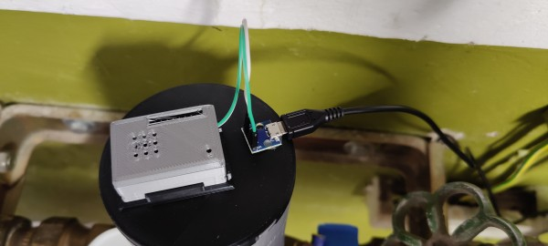
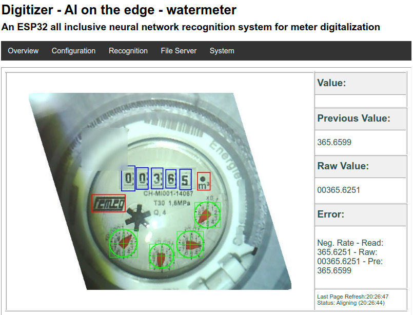

# Wasserzähler mit ESP32-Cam auslesen (Ai on the Edge)
Ein üblicher Wasserzähler kann leider nicht so einfach automatisch ausgelesen werden, es fehlen magnetische, elektronische oder sonstige Schnittstellen. Bleibt nur die Möglichkeit optisch per Kamera den Zählerstand irgendwie auszulesen. Viele Projekte haben schon einige Methoden probiert und funktionieren eher mäßig. 
Zuletzt fand ich ein Projekt welches hervorragend nun auch den Wasserzähler zuverlässig auslesen kann. Das Projekt kann aber auch für andere Zählerstände verwendet werden, wie z.B. Stromzähler.

Das Projekt nennt sich [Ai on the Edge](https://github.com/jomjol/AI-on-the-edge-device/) und setzt sich aus den günstigen Hardwarekomponenten ESP32-Cam, eine kleine SD-Karte und einem vortrainierten neuronalem Netzwerk zusammen, das im Vorfeld vom Ersteller des Projektes mit vielen Bildern von Ziffern verschiedener Zähler und analoger Zeigerpositionen trainiert wurde.

Die ESP32-Cam wird zuerst auf den eigenen Zähler montiert. Anschließend werden die Stellen der Ziffern und Zeiger definiert, die dann später zyklisch erkannt werden.

Die Anbindung an Home Assistant geschieht dann per MQTT.







## benötigte Hardware
* ESP32-Cam
* Käbelchen für Stromversorgung
* UART-TTL-USB-Adapter für die Programmierung der ESP32-Cam (hat kein USB wie eine NodeMCU)
* USB-Netzteil
* Gehäuse gibt's gleich passend zum Projekt bei [Thingiverse](https://www.thingiverse.com/thing:4573481) zum drucken

## Software/Dokumentation
* [AI-on-the-edge-device](https://github.com/jomjol/AI-on-the-edge-device/)


## Auszug Home Assistant YAML
```
sensor:
 - platform: "mqtt"
   name: "Wasserzähler"
   state_topic: "wasserzaehler/main/value"
   value_template: "{{ value }}"
   unit_of_measurement: "m³"
   icon: "mdi:water-pump"
 - platform: "mqtt"
   name: "Wasserzähler_Liter"
   state_topic: "wasserzaehler/main/value"
   value_template: "{{( value | float * 1000 ) | round(2)}}"
   unit_of_measurement: "l"
   icon: "mdi:water-pump"
 - platform: "mqtt"
   name: "Wasserzähler Flussrate"
   state_topic: "wasserzaehler/main/rate"
   value_template: "{{ value }}"
   icon: "mdi:swap-vertical"
 - platform: "mqtt"
   name: "Wasserzähler letzter Wert"
   state_topic: "wasserzaehler/main/timestamp"
   value_template: "{{ value }}"
   icon: "mdi:clock-outline"
binary_sensor:
 - platform: "mqtt"
   name: "Wasserzähler Fehler"
   state_topic: "wasserzaehler/main/error"
   value_template: "{{ value != 'no error' }}"
   json_attributes_topic: "wasserzaehler/main/json"
   icon: "mdi:alert-circle"

utility_meter:
  wasserverbrauch_tag:
    source: sensor.wasserzahler
    cycle: daily
  wasserverbrauch_woche:
    source: sensor.wasserzahler
    cycle: weekly
  wasserverbrauch_monat:
    source: sensor.wasserzahler
    cycle: monthly
  wasserverbrauch_jahr:
    source: sensor.wasserzahler
    cycle: yearly

  wasserverbrauch_tag_liter:
    source: sensor.wasserzahler_liter
    cycle: daily
  wasserverbrauch_woche_liter:
    source: sensor.wasserzahler_liter
    cycle: weekly
  wasserverbrauch_monat_liter:
    source: sensor.wasserzahler_liter
    cycle: monthly
  wasserverbrauch_jahr_liter:
    source: sensor.wasserzahler_liter
    cycle: yearly
```
